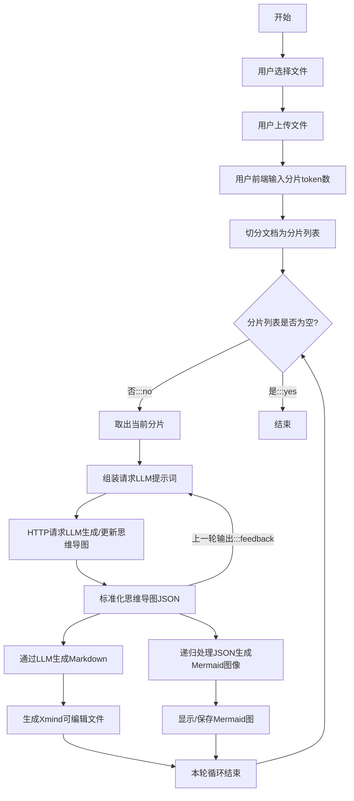

# File_2_MindMap
Upload file to get markdown, get mindmap with Mermaid, post request and get LLM output from aliyun. 

## Config
Remember to input your own api key in the next.config.ts.

## Flow chat
